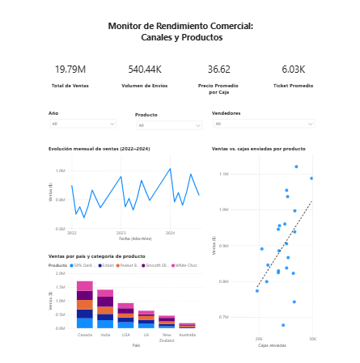

# Análisis Comercial Global: Chocolate Corp

## Contexto y Objetivo
Este proyecto analiza el rendimiento de ventas y la eficiencia de distribución de una empresa global de chocolates. El objetivo es transformar datos transaccionales brutos en un modelo analítico que permita evaluar el desempeño de los vendedores, la rentabilidad por producto y la penetración en mercados internacionales.

## Visualización del Dashboard

## Key Insights (Métricas de Negocio)
* **Ingresos y Volumen**: Monitoreo de ventas totales y cajas enviadas por país y producto.
* **Métrica de Rentabilidad**: Identificación del Precio por Caja (Price Per Box) como indicador clave para evaluar la estrategia de precios en diferentes regiones.
* **Ranking de Ventas**: Identificación de los vendedores con mayor volumen de facturación y eficiencia en la colocación de productos.

## Stack Técnico e Ingeniería de Datos
### 1. SQL 
El valor técnico de este proyecto reside en la normalización de datos contables complejos:
* **Limpieza de Tipos de Datos**: Transformación de la columna `Amount` (cargada originalmente como texto con símbolos de `$` y comas) a tipo `DECIMAL` mediante el uso de anidación de funciones `REPLACE` y `CAST`.
* **Cálculos de Negocio Dinámicos**: Creación de una vista (`Clean_Chocolate_Sales`) que automatiza el cálculo del precio por unidad, incorporando la función `NULLIF` para prevenir errores de división por cero en registros con envíos nulos.
* **Modelado Multidimensional**: 
    * Creación de tablas de dimensión (`Dim_SalesPersons`, `Dim_Products`) mediante selecciones únicas para estandarizar los catálogos de maestros.
    * Estructuración de la tabla de hechos (`Fact_Sales`) para facilitar el análisis temporal y geográfico.

### 2. Power BI (Business Intelligence)
* **Normalización Contable**: Integración de los datos ya limpios por SQL para asegurar la precisión en los totales de venta.
* **Análisis Geográfico**: Visualización de la distribución de ingresos por país.
* **Control de Ventas**: Dashboard interactivo con segmentación por producto y periodos de tiempo.

## Estructura de Archivos
- `Análisis de Desempeño Comercial Glo.txt`: Código completo de limpieza contable, creación de vistas y modelado estrella.
- `Análisis de Desempeño Comercial Global Chocolate Corp.pbix`: Archivo de Power BI con el informe comercial.
- `image.png`: Captura del informe final.
