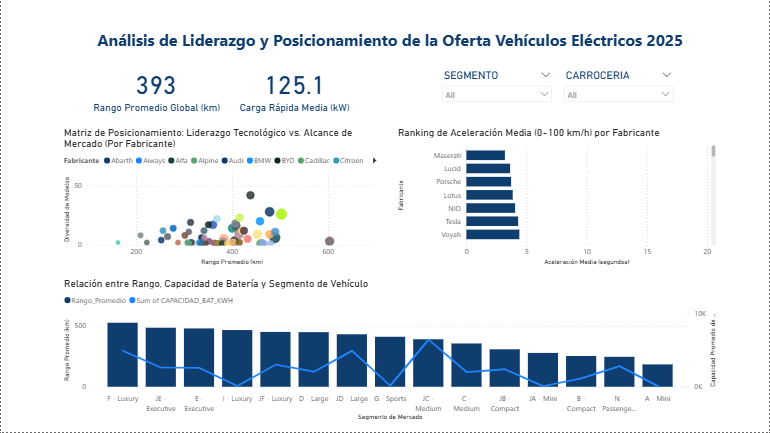

# Análisis de Liderazgo Tecnológico: Vehículos Eléctricos 2025

##  Contexto y Objetivo
Este proyecto analiza el ecosistema global de vehículos eléctricos para 2025, identificando a los líderes por desempeño técnico y posicionamiento de mercado. El objetivo es cruzar métricas de ingeniería (batería, aceleración) con variables de mercado (segmentación y carrocería).

##  Visualización del Dashboard

##  Key Insights (Extraídos del Análisis)
1. **Liderazgo en Performance:** Maserati lidera el ranking de aceleración media con una respuesta inferior a los 4 segundos, seguido de cerca por Lucid y Porsche, consolidando el dominio del segmento de alto rendimiento.
2. **Relación Rango/Segmento:** Existe una correlación directa entre el tamaño del vehículo y su autonomía. El segmento F-Luxury presenta el rango promedio más alto (superando los 500 km), mientras que los segmentos A-Mini y B-Compact priorizan la eficiencia urbana con rangos menores.
3. **Eficiencia Tecnológica:** El rango promedio global se sitúa en 393 km, con una capacidad de carga rápida media de 125.1 kW, marcando el estándar mínimo competitivo para fabricantes en 2025.

## Stack Técnico y Metodología
### 1. SQL (Data Engineering)
Se implementó un flujo de trabajo profesional desde la ingesta hasta el modelado:
- **Limpieza (ETL):** Uso de `COALESCE` para el manejo de valores nulos en capacidades de remolque, volumen de carga y especificaciones de batería
- **Modelado Estrella:** Creación de un esquema robusto con tablas de dimensiones (`DIM_MARCA_MODELO`, `DIM_ESPECIFICACIONES_BAT`, `DIM_FISICAS`) y una tabla de hechos central (`HECHOS_VEHICULOS_EV`) para optimizar las consultas en el dashboard.
- **Integridad:** Implementación de claves primarias, foráneas y restricciones `UNIQUE` para asegurar la calidad del dato.

### 2. Power BI (Data Visualization)
- **Gráficos de Dispersión:** Matriz de posicionamiento para analizar el "Alcance de Mercado" vs. "Liderazgo Tecnológico".
- **Análisis de Rankings:** Visualización descendente de aceleración para destacar a los fabricantes con mayor respuesta mecánica.
- **Interactividad:** Implementación de segmentadores por *Segmento* y *Carrocería* para un análisis granular.

## Estructura de Archivos
- `Análisis de Liderazgo Tecnológico y Posicionamiento de Marca SCRIPTS.sql`: Código completo de creación de base de datos, limpieza y carga.
- `Análisis de Liderazgo Tecnológico y Posicionamiento de Marca.pbix`: Reporte interactivo de Power BI.
- `image.png`: Captura de pantalla del informe final.
