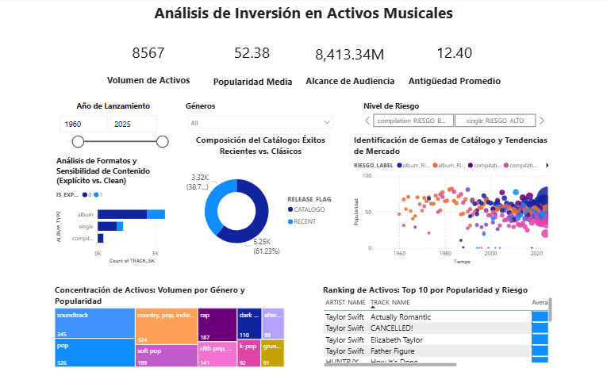

#  Análisis de Inversión: Activos Musicales a Gran Escala

##  Contexto y Objetivo
Este proyecto evalúa la viabilidad financiera y el perfil de riesgo de un portafolio de derechos musicales masivo. El análisis se centra en la segmentación estratégica entre lanzamientos recientes y catálogo consolidado, permitiendo optimizar adquisiciones basadas en la longevidad del activo y su alcance de audiencia.

## 📊 Visualización del Dashboard

## 💡 Key Insights (Basados en 8,567 Activos)
* **Escala del Portafolio**: Se gestiona un volumen de 8,567 activos con un alcance de audiencia total de 8,413.34 millones.
* **Mezcla Estratégica**: El portafolio equilibra crecimiento y estabilidad con un 61.23% (5.25K) de activos recientes frente a un 8.77% (3.32K)de catálogo histórico.
* **Indicadores de Riesgo**: El análisis categoriza los activos mediante un `RIESGO_LABEL` que cruza el tipo de álbum con la sensibilidad del contenido, facilitando la identificación de "Gemas de Catálogo".
* **Madurez del Activo**: La antigüedad promedio del catálogo se sitúa en 12.40 años, lo que garantiza flujos de ingresos probados frente a tendencias volátiles.

## 🛠️ Stack Técnico e Ingeniería de Datos
### 1. SQL 
El script SQL demuestra un dominio de transformación de datos complejos:
**Limpieza de Fechas Críticas**: Uso de expresiones regulares (`REGEXP_LIKE`) para normalizar múltiples formatos de fecha (YYYY-MM-DD y MM/DD/YYYY) en una sola columna estándar de tipo DATE.
**Lógica de Negocio y Flags**: Implementación de sentencias `CASE` para transformar valores booleanos de texto en flags numéricos (`IS_EXPLICIT_FLAG`) y definir etiquetas de riesgo dinámicas.
**Esquema Estrella con Control de Fan-out**:
    * **Dimensiones**: Separación lógica de Artistas (`DIM_ARTISTA_GENERO`), Tiempo (`DIM_TIEMPO`) y Clasificación de Riesgo (`DIM_CONTENIDO_RIESGO`)].
    * **Optimización**: Uso de `GROUP BY` y agregaciones (`MAX`) para consolidar datos de artistas únicos y evitar la duplicidad (fan-out) en la tabla de hechos.
**Integridad Referencial**: Uso de Claves Sustitutas (`SK`) y restricciones de integridad para asegurar un modelo de datos robusto y escalable.

### 2. Power BI (Business Intelligence)
**Análisis de Dispersión**: Visualización de "Popularidad" vs. "Tiempo" para detectar éxitos virales y activos subvalorados.
**Filtros Temporales**: Capacidad de desglose histórico desde 1960 hasta 2025.
**Storytelling**: Dashboard diseñado para la toma de decisiones financieras, destacando el volumen de activos y la concentración por género (Soundtrack, Pop, Rap).

##  Estructura de Archivos
- `Análisis de Inversión en Activos Mu.txt`: Código completo de ETL, limpieza de fechas y modelado estrella.
- `Análisis de Inversión en Activos Musicales.pbix`: Reporte interactivo de Power BI.
- `image.png`: Captura de pantalla del informe final.
