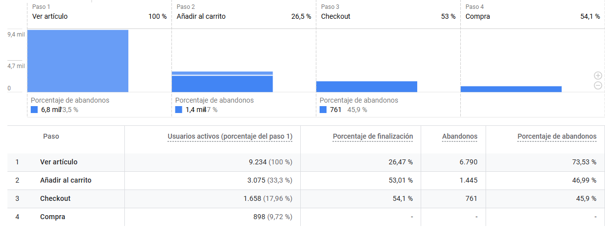
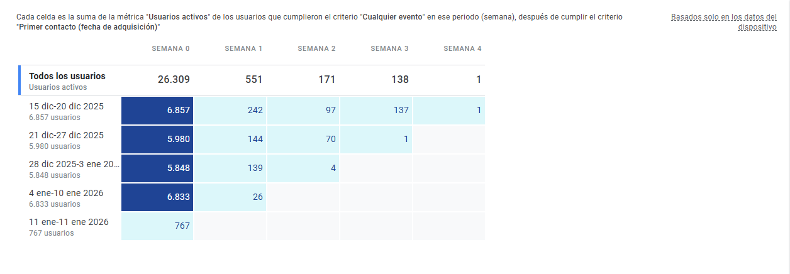
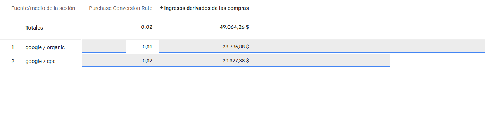
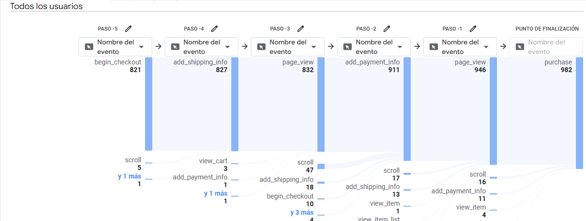

# Análisis de Comportamiento de Compra y Rendimiento: Google Merchandise Store

## Objetivo del Análisis
Evaluar la eficacia del embudo de ventas, la fidelidad de los usuarios a través del tiempo y el impacto financiero de los canales de adquisición para optimizar la estrategia de conversión de la tienda.

---

## 1. Análisis del Embudo de Conversión (Purchase Journey)
Se analiza el recorrido del usuario desde el interés inicial hasta la transacción final. Se detecta una pérdida crítica de usuarios potenciales en la primera etapa de interacción con el producto.

* **Punto de fricción:** El 73.53% de los usuarios abandonan tras ver el artículo sin añadirlo al carrito.

---

## 2. Retención de Usuarios por Cohortes
Este análisis permite visualizar la recurrencia de los usuarios activos semana a semana. Los datos muestran una dependencia alta de la adquisición de tráfico nuevo frente a una baja retención de retorno.

---

## 3. Rentabilidad por Canales de Adquisición
Comparativa del rendimiento entre el tráfico orgánico y el tráfico pagado (CPC). Aunque el tráfico orgánico genera mayor volumen total, el tráfico pagado demuestra ser más eficiente en conversión directa.

---

## 4. Flujo de Comportamiento en el Proceso de Pago
Visualización de la ruta de eventos que siguen los usuarios para completar una compra. Se observa cómo interactúan con la información de envío y pago antes del evento final.

---

## Conclusiones y Recomendaciones

1.  **Optimización del Top-of-Funnel:** Es imperativo mejorar la relevancia de las páginas de producto para reducir el abandono del 73% inicial.
2.  **Inversión Inteligente en CPC:** Dado que la tasa de conversión del tráfico pagado (0.02) duplica al orgánico (0.01), se recomienda aumentar el presupuesto en campañas de búsqueda orientadas a conversión.
3.  **Estrategia de Re-engagement:** La baja retención en la "Semana 1" sugiere que se deben implementar campañas de email marketing o notificaciones push para incentivar el regreso de los usuarios que no compraron en su primera visita.
