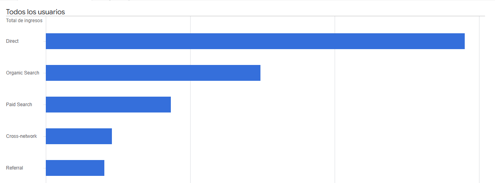

# Análisis de Adquisición y Conversión: Google Merchandise Store

## Objetivo del Análisis
Identificar los canales de adquisición que generan mayor valor para la tienda, analizando no solo el volumen de tráfico, sino su capacidad de conversión y generación de ingresos (**Revenue**).

---

## 1. Rendimiento General y Segmentación
El análisis divide a los usuarios en dos grupos para entender el comportamiento de compra. El canal **Direct** lidera en ingresos, mientras que **Organic Search** domina en volumen de sesiones atraídas.

---

## 2. Distribución de Ingresos por Canal
El siguiente gráfico permite visualizar rápidamente la jerarquía de los canales según el dinero que aportan a la tienda. Se observa que el tráfico directo es la principal fuente de ingresos, seguido por la búsqueda orgánica y pagada.

---

## 3. Eficiencia: Volumen vs. Tasa de Conversión
En este gráfico de dispersión, comparamos la cantidad de sesiones frente a la eficacia de conversión. Los puntos más altos en el eje vertical representan canales con tráfico de mayor "calidad" o intención de compra.

---

## Conclusiones y Recomendaciones

1.  **Optimizar Cross-network:** Presenta la tasa de conversión más alta (0.55%). Es un canal ideal para escalar inversión.
2.  **Mejorar el CRO en Organic Search:** Es el canal que más gente trae, pero su tasa de conversión es baja (0.31%). Hay una oportunidad de mejora en las landing pages.
3.  **Fidelización:** El éxito de 'Direct' indica que la marca es fuerte; se sugiere reforzar con estrategias de retención.
