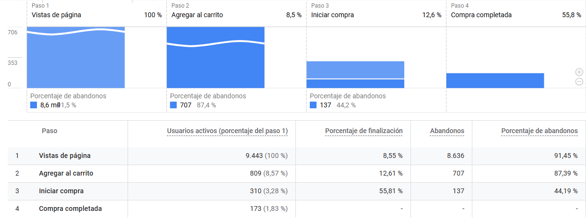
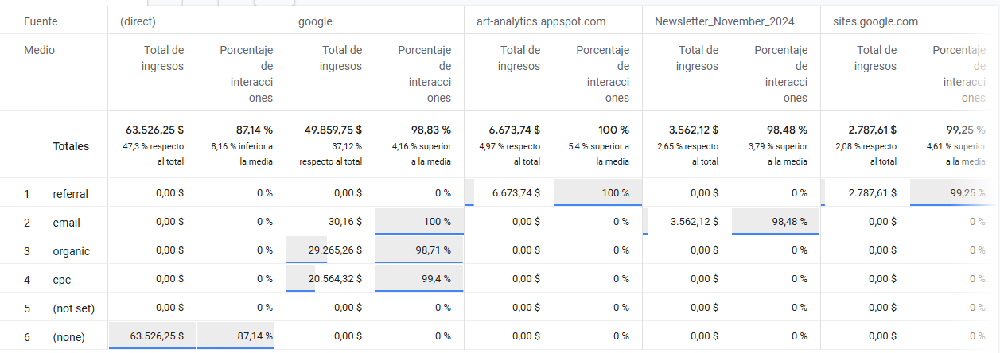
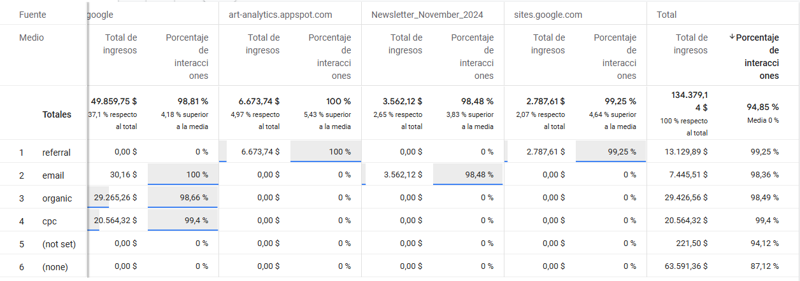
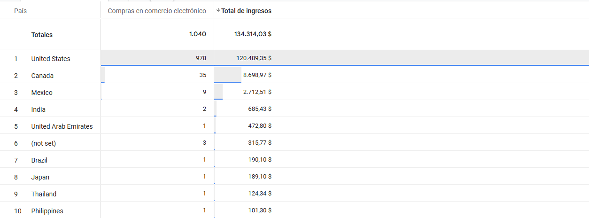

# Análisis de Rendimiento del E-commerce y Embudo de Conversión: Google Merchandise Store

## Objetivo del Análisis
Analizar el rendimiento de la tienda de mercancía de Google y el comportamiento de los usuarios en su proceso de compra, utilizando las exploraciones de GA4 para identificar cuellos de botella y canales de adquisición de alto valor.

---

## 1. Comportamiento en el Embudo de Ventas
El análisis del embudo permite visualizar la progresión del usuario desde la vista de página hasta la compra. Se identifica que el mayor punto de fuga ocurre en el paso inicial, donde se pierde más del 91% del tráfico.

---

## 2. Rendimiento por Fuente y Medio
Este desglose detalla qué combinaciones de origen y medio atraen tráfico de mayor calidad. Mientras que el tráfico directo genera el mayor volumen de ingresos, el tráfico pagado (CPC) destaca por tener la tasa de interacción más alta del sitio.

---

## 3. Distribución Geográfica de Ingresos
El análisis por país revela una concentración masiva de la facturación. Estados Unidos representa el motor principal de la tienda, seguido por Canadá y México con una diferencia de volumen significativa.

---

## 4. Flujo de Navegación del Usuario
A través de la exploración de rutas, observamos el recorrido secuencial. La mayoría de los usuarios inician en la página principal y avanzan hacia vistas de productos y promociones internas, demostrando la relevancia de los banners promocionales.

---

## Conclusiones y Recomendaciones

1. **Optimizar la conversión inicial:** El 91.45% de los usuarios abandona en el primer paso del embudo. Es crítico mejorar la relevancia de las landing pages para convertir vistas en adiciones al carrito.
2. **Escalar Tráfico Pagado (CPC):** Con una tasa de interacción del 99.4%, es el tráfico más cualificado. Se recomienda aumentar el presupuesto en este canal para maximizar el retorno.
3. **Potencial en Email Marketing:** El Newsletter generó más de $3,500 en ingresos directos; fortalecer la base de datos de correos puede diversificar la dependencia del tráfico directo.
4. **Enfoque Regional:** Dado que el 90% de los ingresos provienen de EE. UU., existe una oportunidad de crecimiento implementando campañas localizadas para Canadá y México.
