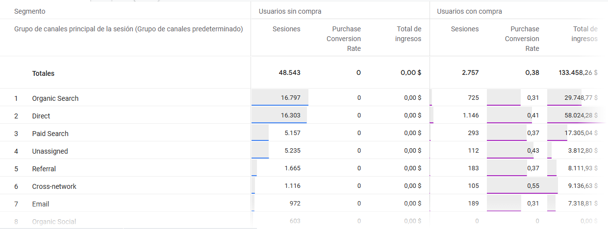
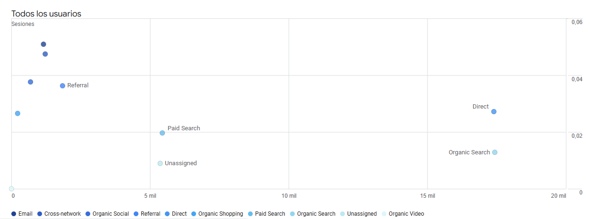

# Análisis de Adquisición y Conversión: Google Merchandise Store (GA4)

## Objetivo del Proyecto
Identificar qué canales de adquisición generan el mayor volumen de ingresos y evaluar la efectividad de cada uno. El análisis busca separar el tráfico masivo de las sesiones que realmente terminan en una transacción, para entender dónde es más rentable captar usuarios.

---

## Metodología Técnica
Para este análisis se utilizó la cuenta demo de Google Analytics 4. Debido a que la métrica de "Tasa de conversión" puede presentar inconsistencias en entornos de prueba, se aplicó la siguiente metodología:

* **Segmentación de Usuarios:** Se crearon dos grupos de control: **Usuarios con compra** y **Usuarios sin compra**.
* **Cálculo de Eficiencia:** Al separar estos grupos, se pudo determinar el rendimiento real de cada fuente de tráfico, comparando el volumen de visitas frente al ingreso generado.

---

## Análisis de las Exploraciones

### 1. Comparativa de Segmentos (Tabla Dinámica)

* **Observación:** La tabla permite ver el desglose por canal. Por ejemplo, en **Direct**, se observa un volumen superior a 64,000 usuarios que no compraron frente a los que sí realizaron una transacción.
* **Utilidad:** Esta vista es fundamental para entender la calidad del tráfico que llega desde cada fuente.

### 2. Ingresos Totales por Canal (Gráfico de Barras)

* **Observación:** El canal **Direct** lidera ampliamente la generación de ingresos, alcanzando casi los $60,000. 
* **Comparativa:** Canales como **Organic Search** y **Paid Search** ocupan el segundo y tercer lugar, aunque con una diferencia notable respecto al tráfico directo.

### 3. Relación Volumen vs. Eficiencia (Gráfico de Dispersión)

* **Observación:** Cada punto representa un canal de adquisición. 
* **Utilidad:** Permite identificar visualmente qué canales son más eficientes (puntos más altos en el eje vertical) y cuáles traen mucho volumen pero pocas ventas (puntos más a la derecha en el eje horizontal).

---

## Conclusiones del Análisis

1.  **Dominio del tráfico Direct:** La mayor parte del flujo de caja proviene de usuarios que acceden directamente a la tienda. Esto indica una base de clientes recurrente y un fuerte reconocimiento de marca.
2.  **Oportunidad en Búsquedas (Organic y Paid):** Estos canales son los siguientes en importancia. Aunque traen menos ingresos que el tráfico directo, muestran una intención de compra clara que podría escalarse.
3.  **Optimización de Canales Secundarios:** Aquellos canales que muestran barras mínimas o nulas en el gráfico de ingresos requieren una revisión. Actualmente están generando sesiones que no se traducen en valor económico para la tienda.

---
**Herramientas utilizadas:** Google Analytics 4 (Exploraciones de formato libre, Segmentación de usuarios y Análisis de ingresos).
